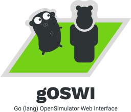

# gOSWI
## Go (lang) OpenSimulator Web Interface

## Purpose of this project

Note: if you don't know what [OpenSimulator](http://opensimulator.org) is, then very likely you won't need this package _ever_.

While OpenSimulator adds a _lot_ of base functionality to pretty much run everything 'out of the box', historically, a handful of functions were _deliberately_ left out of the 'core' system, and left to third-party modules in C#, or, through a few APIs (mostly using XML-RPC, but not all), delegated to external systems (thus allowing a distributed approach in terms of deployment of a 'whole' grid). Relatively simple things (such as the 'splash screen' — what is shown when you select a grid on Firestorm and other OpenSimulator-compatible viewers) as well as much complex ones (such as running the economy system) have been pushed out of the core code, for several reasons, including ideological/theological ones (i.e. the concept that OpenSimulator-based grids should _not_ have an economy because [the love of money is the root of all evil](https://www.kingjamesbibleonline.org/1-Timothy-6-10/) — defended both by extreme-left, atheist, progressive activists, as well as right-wing, conservative Christians), legal ones (running a virtual economy might be illegal in several jurisdictions, or at least require a special license to do so), and practical ones (the 'splash screen' is often used to convey information about the grid which may rely upon statistics processed 'outside' the core OpenSimulator code).

Another area that is underdeveloped is the management of local grid users. Although OpenSimulator includes some console commands to do some user management — basically, creating users, changing their passwords, or email addresses — which is more than enough for a small grid of close-knit developers and content creators, running a _large_ grid, with hundreds of thousands of users, each being able to have multiple 'alts', belonging to different groups, etc. is far beyond the purpose of the 'simple' console commands. Similarly, OpenSimulator doesn't even come with tools to do estate management — although it's fully supported (newly created regions, for instance, _must_ be assigned to an existing estate), the whole backoffice mechanisms to deal with them are left for third-party developers to do. You can always do everything manually, using phpMyAdmin and doing the changes directly on the database, but this approach, again, is just meaningful for managing a handful of estates.

Thus, since OpenSimulator's inception, several 'grid management solutions' have been around, many of which free and open-source. Some are merely plugins for larger content management systems (such as jOpensim for Joomla, Xoopensim for XOOPS, d4os for Drupal); others are standalone (see a 'complete' list on http://opensimulator.org/wiki/Webinterface); most, unfortunately, have stopped their development ages ago. This is especially true of PHP administration tools which relied on pre-PHP PDO functions to connect to the database; unfortunately, such functions have been deprecated and require a lot of time to rewrite... I tried to do that with Xoopensim, but after two weeks of making change after change, and stumbling over and over again on deprecated usage of old PHP functions, I gave up.

Thus this project was born — not in PHP, not in C# (which I hate with passion), but in [Go](https://golang.com) — because it's easy to compile in pretty much everything out there (and I revere the creators of Go with all my heart!). If you're not really willing to learn how to do Go programming, no worries, you will just need to get the appropriate binaries (once I compile them, of course).

## Configuration

- Copy `config.sample.ini` to `config.ini` and adjust for your system (namely, adding the DSN to connect to your database)
- Note that _by default_ `gOSWI` will try to load `config.ini` from the directory where you've got your sources (e.g. if you used `go get -u github.com/GwynethLlewelyn/goswi`, then the path will be set to `~/go/src/github.com/GwynethLlewelyn/goswi`); the same applies to the static files under `./templates/`, `./lib`, and `./assets/` — no matter where you actually place the compiled binary. You can change that behaviour by changing the `templatePath` (which actually changes more than that) and passing the `-config` parameter directly to the compiled binary (or, at best, have the `config.ini` in the same directory as the executable)

### TLS

If you wish to use TLS (i.e. HTTPS), just add the full path to your certificate file (`tlsCRT`) and private key (`tlsKEY`). Obviously you can use self-signed certificates if you wish — the main advantage is not only privacy, but also getting HTTP/2 support, PageSpeed support, and everything you can get these days over TLS which you cannot get over an unencrypted HTTP/1.1 connection.

## Disclaimers and Licenses

The *gopher* (the Go mascot) is an [original design](https://blog.golang.org/gopher) created by renowned illustrator [Renne French](https://www.instagram.com/reneefrench/) and released with a [Creative Commons Attribution 3.0 (Unported) License](https://creativecommons.org/licenses/by/3.0/), to be used on Go-related projects, but is _not_ the official logo.

Parts of the [OpenSimulator logo](http://opensimulator.org/wiki/File:Opensimulator.svg), released under a [Creative Commons Attribution 2.5 Australia (CC BY 2.5 AU)](https://creativecommons.org/licenses/by/2.5/au/) were shamelessly scavenged and ravaged by yours truly.

The fonts used are, per [Google's v.1.9.5 guidelines for Go-related things](https://storage.googleapis.com/golang-assets/Go-brand-book-v1.9.5.pdf), [Work Sans](https://fonts.google.com/specimen/Work%20Sans), licensed under [Open Font License](), and [Roboto](https://fonts.google.com/specimen/Roboto), licensed under an [Apache 2.0 License](https://www.apache.org/licenses/LICENSE-2.0).

The template used, [SB Admin 2](https://startbootstrap.com/template-overviews/sb-admin-2/), has been developed by [Start Bootstrap](http://startbootstrap.com/) — created and maintained by [David Miller](http://davidmiller.io/) — and is based on the [Bootstrap](http://getbootstrap.com/) framework created by [Mark Otto](https://twitter.com/mdo) and [Jacob Thorton](https://twitter.com/fat). It is released under a [MIT license](vendor/startbootstrap-sb-admin-2/LICENSE).

The grid map also requires mentioning its own licensing. I'll try to do it ASAP. And I'm pretty sure I've forgotten to credit RealFaviconGenerator, too.