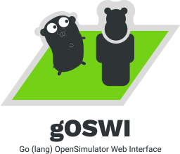

# gOSWI
## Go (lang) OpenSimulator Web Interface

## Purpose of this project

Note: if you don't know what [OpenSimulator](http://opensimulator.org) is, then very likely you won't need this package _ever_.

While OpenSimulator adds a _lot_ of base functionality to pretty much run everything 'out of the box', historically, a handful of functions were _deliberately_ left out of the 'core' system, and left to third-party modules in C#, or, through a few APIs (mostly using XML-RPC, but not all), delegated to external systems (thus allowing a distributed approach in terms of deployment of a 'whole' grid). Relatively simple things (such as the 'splash screen' — what is shown when you select a grid on Firestorm and other OpenSimulator-compatible viewers) as well as much complex ones (such as running the economy system) have been pushed out of the core code, for several reasons, including ideological/theological ones (i.e. the concept that OpenSimulator-based grids should _not_ have an economy because [the love of money is the root of all evil](https://www.kingjamesbibleonline.org/1-Timothy-6-10/) — defended both by extreme-left, atheist, progressive activists, as well as right-wing, conservative Christians), legal ones (running a virtual economy might be illegal in several jurisdictions, or at least require a special license to do so), and practical ones (the 'splash screen' is often used to convey information about the grid which may rely upon statistics processed 'outside' the core OpenSimulator code).

Another area that is underdeveloped is the management of local grid users. Although OpenSimulator includes some console commands to do some user management — basically, creating users, changing their passwords, or email addresses — which is more than enough for a small grid of close-knit developers and content creators, running a _large_ grid, with hundreds of thousands of users, each being able to have multiple 'alts', belonging to different groups, etc. is far beyond the purpose of the 'simple' console commands. Similarly, OpenSimulator doesn't even come with tools to do estate management — although it's fully supported (newly created regions, for instance, _must_ be assigned to an existing estate), the whole backoffice mechanisms to deal with them are left for third-party developers to do. You can always do everything manually, using phpMyAdmin and doing the changes directly on the database, but this approach, again, is just meaningful for managing a handful of estates.

Thus, since OpenSimulator's inception, several 'grid management solutions' have been around, many of which free and open-source. Some are merely plugins for larger content management systems (such as jOpensim for Joomla, Xoopensim for XOOPS, d4os for Drupal); others are standalone (see a 'complete' list on http://opensimulator.org/wiki/Webinterface); most, unfortunately, have stopped their development ages ago. This is especially true of PHP administration tools which relied on pre-PHP PDO functions to connect to the database; unfortunately, such functions have been deprecated and require a lot of time to rewrite... I tried to do that with Xoopensim, but after two weeks of making change after change, and stumbling over and over again on deprecated usage of old PHP functions, I gave up.

Therefore, this project was born — not in PHP, not in C# (which I hate with passion), but in [Go](https://golang.org) — because it's easy to compile in pretty much everything out there (and I revere the creators of Go with all my heart!). If you're not really willing to learn how to do Go programming and/or [basic installation](https://golang.org/doc/install), no worries, you will just need to get the appropriate binaries (once I compile them, of course).

## Configuration

- Because Second Life and OpenSimulator internally use JPEG2000 for all images, we have to convert those to browser-friendly images, which we'll do with ImageMagick 7 — so make sure you are correctly set up to use the CGo-based ImageMagick wrapper:
	- install ImageMagick according to https://github.com/gographics/imagick (go for version 7)
	- make sure that your particular version of ImageMagick supports `JP2` (that's JPEG2000)
	- Don't forget to set `export CGO_CFLAGS_ALLOW='-Xpreprocessor'` in your shell
  My apologies for having to resort to ImageMagick, but there is no native Go library to decode JPEG2000 images; believe me, I've tried a _lot_ of alternatives (including several kinds of external applications/commands). Decoding JPEG2000 is immensely complex (even if the code to do so in C is open source) and way, way, way beyond my abilities as a programmer
- Copy `config.sample.ini` to `config.ini` and adjust for your system (namely, adding the DSN to connect to your database)
- To get a fully-functional map, adjust `assets/js/leaflet-gridmap.js` with your system's configuration
- Do *not* forget to set `cookieStore` to a randomly generated password!
- Note that _by default_ `gOSWI` will try to load `config.ini` from the directory where you've got your sources (e.g. if you used `go get -u github.com/GwynethLlewelyn/goswi`, then the path will be set to `~/go/src/github.com/GwynethLlewelyn/goswi`); the same applies to the static files under `./templates/`, `./lib`, and `./assets/` — no matter where you actually place the compiled binary. You can change that behaviour by changing the `templatePath` (which actually changes more than that) and passing the `-config` parameter directly to the compiled binary (or, at best, have the `config.ini` in the same directory as the executable)
- I had to move from session storage in cookies to a memory-based approach, simply because the session data stored in cookies was growing and growing until it blew the established 4K limit. Now, if the application is _not_ running, all the stored session data is _lost_. I've been toying around the following possibilities:
  - Using either Redis/memcached as permanent KV storage for the session data; this, however, requires that people configure one of those servers, and I'd have to offer several possibilities: check if either Redis/memcached is running and call the appropriate library (but all would have to be compiled into the code — or offer a tag-based approach for compiling with one or the other option), and, if not, fall back to the memory store
  - Adapt Gin-Gonic to use the Gorilla FileSystem storage (Gin-Gonic sessions use Gorilla sessions underneath)
  - Adapt Gin-Gonic to use one of the embedded KV stores I'm _already_ using for persisting data (e.g. the image cache)

  I haven't still decided what I'll do...

### TLS

If you wish to use TLS (i.e. HTTPS), just add the full path to your certificate file (`tlsCRT`) and private key (`tlsKEY`). Obviously you can use self-signed certificates if you wish — the main advantage is not only privacy, but also getting HTTP/2 support, PageSpeed support, and everything you can get these days over TLS which you cannot get over an unencrypted HTTP/1.1 connection.

### New Relic

The latest versions come with (experimental) support for [New Relic](https://newrelic.com/) instrumentation (embedded Go agent). Setting it up is as easy as registering for the free version of New Relic, adding a new (Go) app and grabbing your license key. You'll only need to add the app name and the license key to `config.ini`, and, in theory at least, you'll be getting data on your New Relic console. Instrumentation is done via middleware, which is only active if gOSWI manages to get a valid connection to New Relic (thus, if you see any problems or slowdown, you can just remove the configuration, and no extra code will be running).

## Disclaimers and Licenses

The *gopher* (the Go mascot) is an [original design](https://blog.golang.org/gopher) created by renowned illustrator [Renne French](https://www.instagram.com/reneefrench/) and released with a [Creative Commons Attribution 3.0 (Unported) License](https://creativecommons.org/licenses/by/3.0/), to be used on Go-related projects, but is _not_ the official logo.

Parts of the [OpenSimulator logo](http://opensimulator.org/wiki/File:Opensimulator.svg), released under a [Creative Commons Attribution 2.5 Australia (CC BY 2.5 AU)](https://creativecommons.org/licenses/by/2.5/au/) were shamelessly scavenged and ravaged by yours truly.

The fonts used are, per [Google's v.1.9.5 guidelines for Go-related things](https://storage.googleapis.com/golang-assets/Go-brand-book-v1.9.5.pdf), [Work Sans](https://fonts.google.com/specimen/Work%20Sans), licensed under [Open Font License](), and [Roboto](https://fonts.google.com/specimen/Roboto), licensed under an [Apache 2.0 License](https://www.apache.org/licenses/LICENSE-2.0).

The template used, [SB Admin 2](https://startbootstrap.com/template-overviews/sb-admin-2/), has been developed by [Start Bootstrap](http://startbootstrap.com/) — created and maintained by [David Miller](http://davidmiller.io/) — and is based on the [Bootstrap](http://getbootstrap.com/) framework created by [Mark Otto](https://twitter.com/mdo) and [Jacob Thorton](https://twitter.com/fat). It is released under a [MIT license](vendor/startbootstrap-sb-admin-2/LICENSE).

I've tried to stick to their original files for as long as I could (merely linking to them), but, over time, I had to make more and more changes to them. CSS was getting so many exceptions that I had to create my own file. It's not minified, since I use all sorts of caches and proxies in front of my setup — namely Cloudflare and Google's PageSpeed module for `nginx` — so I don't worry a lot about 'minification'.

Most colours come from the awesome [Nord colour palette](https://www.nordtheme.com/), released under a [MIT license](https://github.com/arcticicestudio/nord/blob/develop/LICENSE.md). I have to admit that I'm in love with that colour scheme, and abuse and overuse it pretty much everywhere. Fortunately, if you hate it, it should be quite easy to change to something else!

Some code was _inspired_ on [OpenSim Web Interface Redux](https://github.com/BigManzai/opensimwiredux) (OpenSimWIRedux) as well as the connection to the Remote Admin XML-RPC as provided by [Marcel Edward](https://github.com/MarcelEdward/OpenSim-RemoteAdmin). At the time of writing this, OpenSimWIRedux is currently going through a code rewrite and not fully operational, but you can still look at its files.

The grid map also requires mentioning its own licensing. It uses various sources: the actual component that displays map tiles is [Leaflet](https://leafletjs.com/). The overall inspiration also comes from OpenSimWIRedux, but they never adopted Leaflet — but stick to the Google Maps API. Because the Google Maps API has been so widely abused, Google has placed very harsh restrictions on its usage. You need to register for a key (or your tiles will have watermarks — even if they are _your_ tiles...). You cannot include the Google APIs in anything remotely 'commercial' (not even if you have, say, a website for a non-profit which 'sells' a product for a fee to raise funds) — to do so, you need to purchase a commercial license. Even though 'personal use' is allowed and even encouraged, it requires publishing your key to anyone who downloads your software (this is exactly what OpenSimWIRedux does — who knows which key they're using...), which, IMHO, is not a good idea.

Other OpenSimulator Web Interfaces, such as [MWI by Myopengrid](https://github.com/Myopengrid/mwi) — which I used profusely for many years — have their own solution for tile visualisation (MWI has not been updated since 2014 and uses a version of [Laravel](https://laravel.com/) which is so ancient that it's not even referred to on the official website). By contrast, Linden Lab switched from their own in-house solution, which worked reasonably well in the olden times, then to the Google Maps API, and finally to Leaflet, which works _far_ better. After much digging around, you can see that the page for https://maps.secondlife.com/ includes a full version of Leaflet (1.4.0 at the time of writing), to which, after line 8600 or so, Linden Lab has added their own code to use Leaflet. This code is preceded by a MIT-like license, which means that I'm able to reuse it and modify it, so long as I retain their copyright notice from 2016. There have been many changes and simplifications to LL's original code. I'm happy to report that it works flawlessly :-)

The [Libravatar](https://libravatar.org/) code is partially inspired on [Surrogator](https://sourceforge.net/p/surrogator/wiki/Home/), written in PHP by Christian Weiske (<cweiske@cweiske.de>) and licensed under the [AGPL v3](https://www.gnu.org/licenses/agpl-3.0.html) or later.

All favicons were generated by [RealFaviconGenerator](https://realfavicongenerator.net/).

## GPG Fingerprint

In case you need it to send me encrypted emails:

